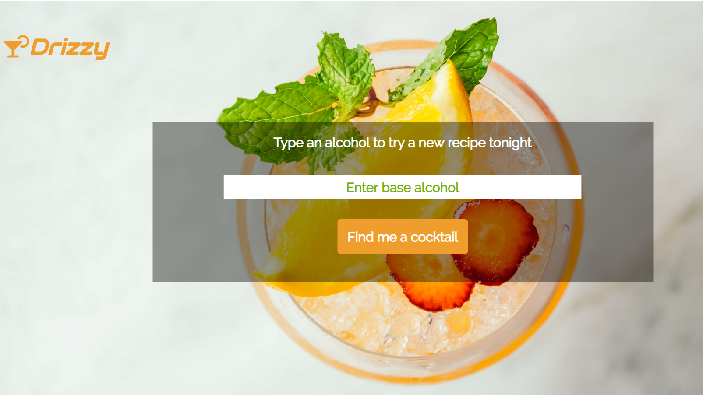
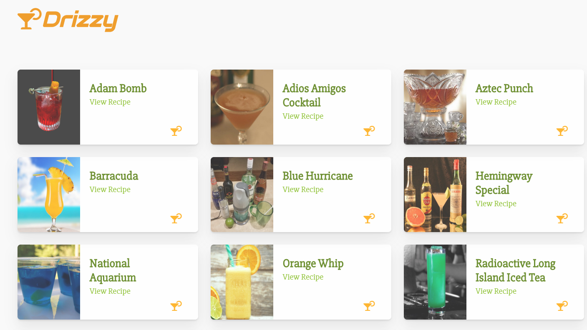
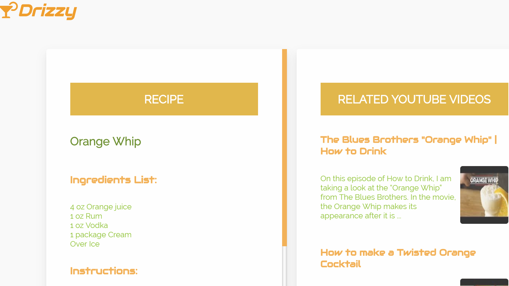

#Drizzy APP

An app that allows users to key in the base alcohol they have available (or would like to try) and on input
generate a list of cocktail recipes that the user can pick from. 

##Motivation

I wanted to develop an app that would inspire drink ideas. This could especially be handy when hosting parties or
on a weekend when you're simply looking to unwind and relax. 

##Screenshots

Home Screen:

Cocktail List:

Recipe and Videos:

##Built-With

* HTML
* CSS
* Javascript 
* JQuery

##Author

Pratik Panchal

##Demo

Live Demo

Known Bugs/Issues

* The custom scrollbar is only displayed on Chrome (lacking cross-browser compatibility) but was kept to maintain
the theme (stylistically)

* The Youtube API for video sometimes behaves unexpectedly(primarily due to quota restrictions) which were identified during testing. 
